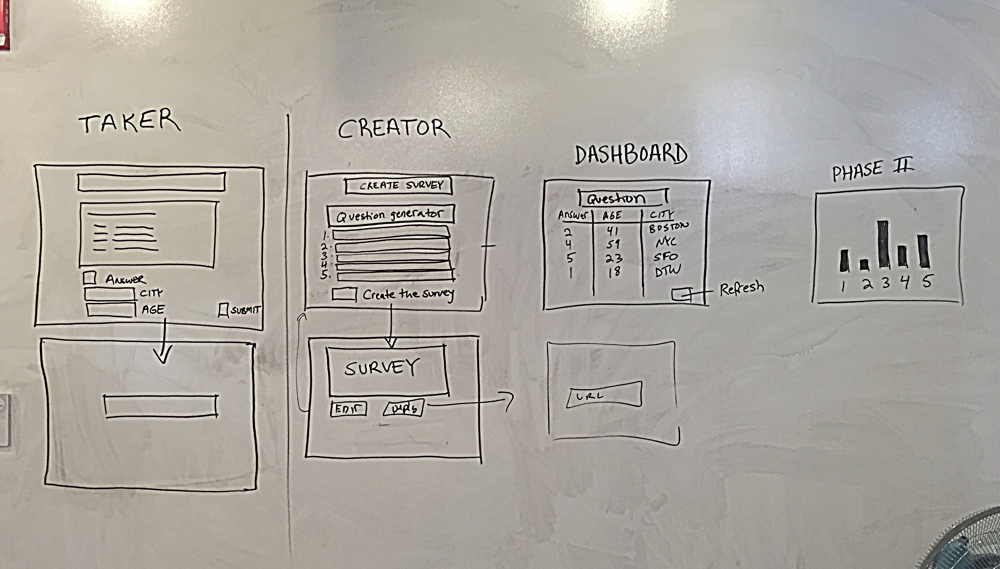

# README For Babbage-squad Project3-Survey
This README file is for general information and details on the front end of the project.  For the backend README file see:https://github.com/mkutter72/project2-api/blob/master/README.md

## Users
The survey program will have two types of roles. Creators and takers.
## Users Stories:
### General Creator Stories
* As a creator I want to create an account
* As a creator I want to login with a secure login
* As a creator I want to create a one question survey
* As a creator I want to specify up to 5 answers to a question
* As a creator I would like to be able to give the survey a name
* As a creator I want to be able to collect a nickname, city, age, and answer from the survey taker
* As a creator I want to be able to generate a survey using a randomly generated URL
* As a creator I want to be able to view a dashboard fwhere I can request a survey showing all of the answers, nicknames, ages, and cities
* As a creator I want to be able to destroy a survey

### General Taker Stories
* As a taker I want to be able to go to a survey by clicking on a random url
* As a taker I want to be able answer the single question survey
* As a taker I want to be able to submit my survey
* As a taker I want to be able to give my nickname, city, and age within the survey

##Additional Stories for Phase II
### Creator Stories
* As a creator I would like to be able to create multiple surveys
* As a creator I would like to be able to select a survey by name to view in the dashboard
* As a creator I would like to be able to select a survey by name to destroy
* As a creator I would like to be able to create a survey with multiple questions
* As a creator I would like to be able to update any question within any survey at any time
* As a creator I would like to be able to have answers selected froma drop down menu or entered in a text box format
* As a creator I would like to be able to have the dashboard update in real time to see the answers pour in as they are completed
* As a creator I would like to specify any numbers of answer to a question
* As a creator I would like to view the quantitative data for any survey

### Taker Stories
* As a taker I would like to be able to view a summary of submitted answers after I submit my answers

##Wireframe Diagrams

##Workflow Planning
* Define user stories
* Create Wireframe for Website
* Analysis of user stores for determining what data collections are present in the database
* Consider what queries will be needed to retrieve and operate on data tables
* Create JSON for a survey and return it from a simple server to work on HTML/JS frontend development
* Create database and models and test with mongodb
* manually populate database
* implement retrieval routes and test with postman
* Implement routes and test with postman
* Create Website with function controls but not final organization
* Create JavaScript for DOM manipulation and AJAX on the front-end
* Integrate front and back ends
* Make Website look nice
* Work on Phase II tasks

## Technologies Used
HTLM, CSS, Boostrap
JavaScript,  JQuery, AJAX, JSON
Handlebars, Node.js, Express, Mongodb, Mongoose

##URL to Project3
http://mkutter72.github.io/plonk_front_end/
